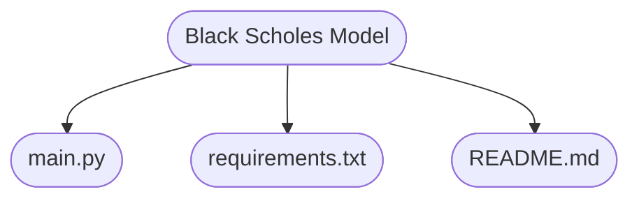
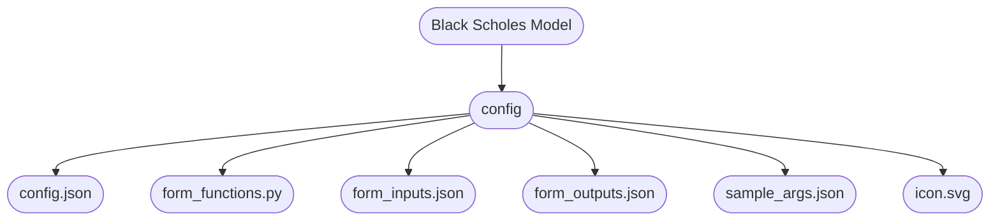
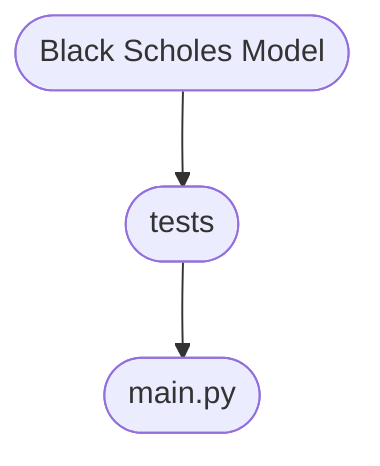
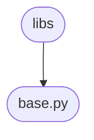

# Workers

**Workers** are like building blocks, which when combined together, can craft powerful workflow solutions. Workers are designed to **create** unique solutions based on the needs of each user.

By leveraging the user library to **create** a worker, users gain the flexibility to define precise behaviors, integrate with various systems, and address specific requirements efficiently. This approach ensures that workers are not just generic tools but are purpose-built to fit seamlessly into diverse workflows, maximizing productivity and innovation.

<br>

## Requirements

Below are the necessary tools and extensions that you will need in order to start developing a worker:

- **Visual Studio Code** - Or any other IDE, [check](https://code.visualstudio.com/docs/setup/setup-overview) here for an installation guide.
- **GitHub Desktop** - Optional, [here](https://docs.github.com/en/desktop/installing-and-authenticating-to-github-desktop/installing-github-desktop) you can find how to install.
- **Dev Containers** - [Extension](https://code.visualstudio.com/docs/devcontainers/tutorial#_install-the-extension) in VSCode.
- **WSL** - If you are using Windows refer to the installation [here](https://learn.microsoft.com/en-us/windows/wsl/install-manual)
- **Git** - [Installation](https://git-scm.com/downloads) guide. Or any other version control system.

<br>

## Cloning the Repository

The first developement stage is to create a local directory in your machine where you will be cloning the **repository** into it and use it as a work folder for the worker.

You can manually go in your machine and create a new directory or use the terminal to create it. Below is an example of how to create a new directory using the terminal using te **WSL** terminal:


```bash
    mkdir my_workers
```

Refer to your operating system on how to create a new directory using the terminal.

Before starting the creation of our worker, we must first clone the **github** [repository](https://github.com/Everysk/workers-sample). For this guide we will be using Visual Studio Code as our IDE, but feel free to use any other IDE it will work just as well.

So go ahead and access the **repository** URL and log in with your **GitHub** account. Once you are logged in, navigate to the green button where it is written **Code** and click on it.

Once clicked we have three options for cloning the repository:

- **HTTPS**: This is the most common way to clone a repository, it uses the URL of the repository.

```bash
    git clone https://github.com/Everysk/workers-sample
```

- **SSH**: This method uses the SSH key to clone the repository. You will need to have the SSH key configured in your **GitHub** account.

```bash
    git clone git@github.com:Everysk/workers-sample.git
```

- **GitHub CLI**: This method uses the **GitHub CLI** to clone the repository. Click [here](https://cli.github.com/) for more information on how to use the **GitHub CLI** to clone the repository.

Now you can open the **Visual Studio Code** with your newly created directory and inside there open a terminal and paste the command for cloning the repository.

<br>

After following along with the steps above, you should have all the necessary tools and extensions to start developing your worker.

Regarding the Operating System, there is no restriction, you can use **Windows**, **Linux**, or **MacOS**.

<br>

## Planning the Worker

Let's imagine a hypothetical scenario where we wish to create a worker that will receive a **Datastore** and will calculate some data using the [Black-Scholes Model](https://en.wikipedia.org/wiki/Black%E2%80%93Scholes_model) and it will output the modified Datastore.

<br>

## Structuring our Code and Files

To create the necessary structure for our worker, if you are using **Visual Studio Code**, we have at our disposal the **Create Folder Structure** Task.

To use it, open the command palette by pressing `Ctrl + Shift + P` and type `Tasks: Run Task` and select the `Create Folder Structure` option. Then write the name of the worker on the pop up that will appear on the top middle of your screen: `black_scholes_model`.

By default, the convention name of the folders for the workers will be: `wk_<worker_name>`. You may choose to remove the prefix `wk_` from the folder name if you wish, as I mentioned before, this is just a convention.

<br>

Alternatively, to start creating our **worker** we must first create a directory with the name of our worker. In this case, we shall name it `wk_black_scholes_model`. Keep in mind that we are using **Linux** for this segment, feel free to follow along with your operating system:

```bash
    mkdir wk_black_scholes_model
```

Then, inside the directory, we create the following subdirectories:

```bash
    mkdir -p wk_black_scholes_model/config
    mkdir -p wk_black_scholes_model/tests
```

<br>

## Understanding the directories

Below we have the directory structure which we will use as a starting point in order to created our **workers**:

```bash
    wk_black_scholes_model/
    ├── config
    │   ├── config.json
    │   ├── form_functions.py
    │   ├── form_inputs.json
    │   ├── form_outputs.json
    │   ├── sample_args.json
    │   └── icon.svg
    └── tests
        └── main.py
    ├── main.py
    ├── README.md
    ├── requirements.txt
```

Let's understand how each directory and file behave inside the structure.

<br>



<br>

Below we the three main files which will be located in the root directory of our worker:


### main.py

The `main.py` file is where the worker **logic** is implemented. There we will define the class, import statements, and methods. There is also the option of having more than one python file at the same level.

<br>

### README.md

Inside the markdown file, we will write a **brief** and **concise** description of the worker, what it does, its purpose, and how to use it.

<br>

### requirements.txt

<br>

The `requirements.txt` file is used to **keep track** of all the necessary libraries that the worker needs in order to function properly.

<br>

Alongside with the three main files, we will also have the `config` and `tests` directories:


### config

<br>



<br>

The `config` directory, as the name suggests, is where we store the configuration files for our **worker**. The `config` directory will contain the following files:

- `config.json`: Is used to **store** the worker ID, the name of the worker, description, category, and any other **relevant information** about the worker that falls under these conditions. When you first create this file, leave the `id` field empty, as it will be filled automatically when the worker get's deployed.

- `form_functions.py`: This python file also serves as a way of **configuring** the worker by defining methods which will be used to manipulate the structure of the **input** and **output** forms. It can also be used to set a specific worker type, such as `basic` or `forker` and control factors like the visibility of the worker.

- `form_inputs.json`: This file is used to **define** all the necessary fields that the user must fill in order to run the worker.

- `form_outputs.json`: Depending on the input data, the worker may return different outputs, this file is used to **define** the output fields that the worker will return.

- `sample_args.json`: This file is used to **store** the sample arguments that will be used to run the worker. It is used for **debugging** purposes.

- `icon.svg`: The `icon.svg` file is **optional** and it is used to visually personalize and represent the worker inside the platform. The file format must be **SVG** and the size limit is **5KB** .

<br>

### tests



<br>

The `tests` directory is where we simply **store** the test cases for our **worker**. The `tests` directory will contain a single python file, `main.py`, where we will write all the test cases for the worker.

As a important remainder, the number of **test files** will be equivalent to the number of **python files**.

<br>


## Writing the Logic

Inside the `main.py` file we can start writing the code for our **worker**:

```python
    import numpy as np
    import pandas as pd

    from everysk.sdk import WorkerBase
    from everysk.sdk.entities import Datastore, BaseEntity

    from everysk.core.datetime import DateTime
    from everysk.core.object import BaseDict

    class BlackScholsModel(WorkerBase):
        """
        The Black Scholes Model class for calculating the Black-Scholes Model.

        Attributes:
            storage_settings (BaseDict): Storage settings for storing the worker.
            entity (BaseEntity): Entity to be used in the worker.
            entity_name (str): Name of the entity to be generated or updated.
        """
        storage_settings: BaseDict = None
        entity: BaseEntity = None
        entity_name: str = None

        def calculate_ttm(maturity_date_series: str, reference_date: str) -> int | float:
            """
            Method to calculate Time to Maturity (TTM).

            Args:
                maturity_date_series (str): Series of maturity dates in 'YYYYMMDD' format.
                reference_date (str): Reference date in 'YYYYMMDD' format.

            Returns:
                (int, float): Series of TTM values in years.
            """
            reference = DateTime.strptime(reference_date, "%Y%m%d")
            maturity_dates = pd.to_datetime(maturity_date_series.astype(str), format="%Y%m%d")
            ttm_values = (maturity_dates - reference).dt.days / 365.25
            return ttm_values

        def black_scholes_merton(op_type: str, K: int | float, T: int, S: int | float, q: int | float, r: int | float, sigma: int | float) -> tuple:
            """
            Compute the Black-Scholes-Merton option pricing model.

            Args:
                op_type (str): Option type ('C' for call, 'P' for put).
                K (int, float): Strike price.
                T (int): Time to maturity (in years).
                S (int, float): Current stock price.
                q (int, float): Dividend yield.
                r (int, float): Risk-free interest rate (annualized).
                sigma (int, float): Volatility of the stock (annualized).

            Returns:
                tuple: containing the d1 and d2 term in the BSM formula, and also the option price used.
            """
            alpha = 1 if op_type[0].upper() == 'C' else -1
            r = np.log(1 + r)  # Convert interest rate to logarithmic form

            d1 = (np.log(S / K) + (r - q + 0.5 * sigma**2) * T) / (sigma * np.sqrt(T))
            d2 = d1 - sigma * np.sqrt(T)

            price = alpha * (S * np.exp(-q * T) * norm.cdf(alpha * d1) - K * np.exp(-r * T) * norm.cdf(alpha * d2))
            return d1, d2, price

        def handle_inputs(self) -> None:
            """
            Process the storage settings to define the way
            the entity will be processed.
            """
            self.storage_settings = self.script_inputs.storage_settings

        def handle_outputs(self) -> None:
            """
            After processing is done the resulting entity
            will be returned.
            """
            result = BaseDict(**{self.entity_name: self.entity})
            return result

        def handle_tasks(self) -> None:
            """

            """
            self.entity = Datastore(name=self.entity_name, data={})

    def main(args: BaseDict) -> BaseDict:
        BlackScholsModel(args).run()
```

<br>

## Using the Shared Directory

If you take a look at your directory structured you will notice a `libs` directory in the same level as your worker. This directory can be used to store code that is **shared** between multiple workers. In other words, you can place any repeated code in there and simply import it in your worker.


For that, create a new python file called `base.py` inside the `libs` directory:



<br>

Inside this newly created python file you are now able to add all the repeated code. For this example let's move both methods `calculate_ttm` and  `black_scholes_merton` to this file. Doing this gives us the possibility of reusing both functions inside another file:

```python
    from everysk.sdk import WorkerBase

    class Base(WorkerBase):

        def calculate_ttm(maturity_date_series: str, reference_date: str) -> int | float:
            """
            Method to calculate Time to Maturity (TTM).

            Args:
                maturity_date_series (str): Series of maturity dates in 'YYYYMMDD' format.
                reference_date (str): Reference date in 'YYYYMMDD' format.

            Returns:
                (int, float): Series of TTM values in years.
            """
            reference = DateTime.strptime(reference_date, "%Y%m%d")
            maturity_dates = pd.to_datetime(maturity_date_series.astype(str), format="%Y%m%d")
            ttm_values = (maturity_dates - reference).dt.days / 365.25
            return ttm_values

        def black_scholes_merton(op_type: str, K: int | float, T: int, S: int | float, q: int | float, r: int | float, sigma: int | float) -> tuple:
            """
            Compute the Black-Scholes-Merton option pricing model.

            Args:
                op_type (str): Option type ('C' for call, 'P' for put).
                K (int, float): Strike price.
                T (int): Time to maturity (in years).
                S (int, float): Current stock price.
                q (int, float): Dividend yield.
                r (int, float): Risk-free interest rate (annualized).
                sigma (int, float): Volatility of the stock (annualized).

            Returns:
                tuple: containing the d1 and d2 term in the BSM formula, and also the option price used.
            """
            alpha = 1 if op_type[0].upper() == 'C' else -1
            r = np.log(1 + r)  # Convert interest rate to logarithmic form

            d1 = (np.log(S / K) + (r - q + 0.5 * sigma**2) * T) / (sigma * np.sqrt(T))
            d2 = d1 - sigma * np.sqrt(T)

            price = alpha * (S * np.exp(-q * T) * norm.cdf(alpha * d1) - K * np.exp(-r * T) * norm.cdf(alpha * d2))
            return d1, d2, price
```

<br>

Then, back in your **worker** directory, you can just import the new class and modify the `BlackScholsModel` class to inherit from the `Base` class, giving us access to the methods without having to rewrite them every time

```python
    from libs.base import Base

    class BlackScholsModel(Base):
        ...
```

<br>

## Worker Configuration

Inside the `config.json` file, insert the following information which will be used to **configure** the worker by giving it a unique identifier and also set a few configuration details that will be shown in the **interface**:

```json
    {
        "id": "",
        "name": "Black Scholes Model",
        "description": "Worker that calculates the Black-Scholes Model",
        "category": "Calculator",
        "visible": true,
        "version": "v1",
        "icon": "data",
        "type": "BASIC",
        "script_runtime": "python",
        "script_entry_point": "main",
        "tags": [],
        "sort_index": 1,
        "default_output": "SINGLE",
        "ports": [
            {
            "value": "in",
            "label": "IN",
            "type": "input",
            "is_visible": true
            },
            {
            "value": "out",
            "label": "OUT",
            "type": "output",
            "is_visible": true
            }
        ],
        "created": null,
        "updated": null
    }
```

<br>

Moving into the `form_functions.py` file, we will define **two** methods that will be used to **manipulate** the storage mode of the worker:

The first one being defined as `storage_mode_create`, create mode just means that a new **Datastore** will be created inside the platform. The second method, `storage_mode_update`, which will be used to update the any **Datastore** that already exists inside the platform.

```python
    def storage_mode_create(form_data, *args):
        black_schols_model_input = form_data.get('black_schols_model_input', {})
        storage_settings = black_schols_model_input.get('storage_settings', {})
        storage_mode = storage_settings.get('storage_mode',{})
        select = storage_mode.get('select',{})
        value = select.get('value',{})
        return value.lower() == 'create'

    def storage_mode_update(form_data, *args):
        black_schols_model_input = form_data.get('black_schols_model_input', {})
        storage_settings = black_schols_model_input.get('storage_settings', {})
        storage_mode = storage_settings.get('storage_mode',{})
        select = storage_mode.get('select',{})
        value = select.get('value',{})
        return value.lower() == 'update'
```

<br>

In the `form_inputs.json` file, we will define an **input field** that the user must fill in order to run the worker:

```json
    [
        {
            "id": "black_scholes_model_input",
            "name": "Black Scholes Model Input",
            "type": "assembler",
            "fields": [
                {
                    "id": "input_black_scholes",
                    "name": "Black Scholes Model",
                    "paddingLeft": 0,
                    "paddingRight": 0,
                    "paddingTop": 0,
                    "paddingBottom": 0,
                    "displayName": true,
                    "withoutMessages": false,
                    "fields": [
                        {
                            "id": "name",
                            "name": "Name",
                            "placeholder": "",
                            "tipover": "",
                            "paddingLeft": 4,
                            "paddingRight": 0,
                            "paddingTop": 0,
                            "paddingBottom": 0,
                            "gridSizeMd": 12,
                            "mandatory": true,
                            "displayName": true,
                            "withoutMessages": false,
                            "variantOptions": [
                            {
                                "label": "Template Text",
                                "value": "metaString"
                            },
                            {
                                "label": "Upstream Data",
                                "value": "previousWorkers"
                            }
                            ],
                            "defaultVariant": "metaString",
                            "variants": {
                            "metaString": {
                                "type": "metaString",
                                "helperText": "Set the datastore name using template text.",
                                "maxLength": 250,
                                "defaultValues": {
                                "select": {
                                    "label": "",
                                    "value": ""
                                }
                                },
                                "filterType": [
                                "number",
                                "string",
                                "date"
                                ]
                            },
                            "previousWorkers": {
                                "type": "nestedAttributes",
                                "helperText": "Set the datastore name from a previous worker.",
                                "defaultValues": {
                                "select": {
                                    "label": "",
                                    "value": ""
                                }
                                },
                                "options": [],
                                "filterType": [
                                "string"
                                ]
                            }
                            }
                        }
                    ]
                },
                {
                    "id": "storage_settings",
                    "name": "Storage Settings",
                    "type": "assembler",
                    "paddingLeft": 0,
                    "paddingRight": 0,
                    "paddingTop": 0,
                    "paddingBottom": 0,
                    "gridSizeMd": 12,
                    "mandatory": false,
                    "displayName": false,
                    "withoutMessages": false,
                    "fields": [
                    {
                        "id": "storage_mode",
                        "name": "Storage Mode",
                        "placeholder": "Select the storage mode",
                        "helperText": "Select an option to storage the entity.",
                        "paddingLeft": 0,
                        "paddingRight": 0,
                        "paddingBottom": 0,
                        "paddingTop": 0,
                        "gridSizeMd": 12,
                        "mandatory": true,
                        "displayName": true,
                        "withoutMessages": false,
                        "variantOptions": [
                        {
                            "label": "Fixed Value",
                            "value": "select"
                        }
                        ],
                        "defaultVariant": "select",
                        "variants": {
                        "select": {
                            "type": "select",
                            "defaultValues": {
                            "select": {
                                "value": "create",
                                "label": "Create"
                            }
                            },
                            "options": [
                            {
                                "value": "update",
                                "label": "Update"
                            },
                            {
                                "value": "create",
                                "label": "Create"
                            }
                            ]
                        }
                        }
                    }
                    ]
                }
            ]
        }
    ]
```

In the example above, we defined **two fields** that will be used to get the information about which **number** will receive the message, and what will the **message** be.

<br>

In the `form_outputs.json` file, we can define the type of output that the worker will return, for our case we will just use `SINGLE`:

```json
    {
    "SINGLE": [
        {
        "value": "black_scholes_model",
        "label": "Black Scholes Model",
        "type": "datastore",
        "list_item_type": "",
        "nested_outputs": [
        {
          "value": "id",
          "label": "ID",
          "type": "string"
        },
        {
          "value": "name",
          "label": "Name",
          "type": "string"
        },
        {
          "value": "link_uid",
          "label": "Link UID",
          "type": "string"
        },
        {
          "value": "date",
          "label": "Date",
          "type": "date"
        },
        {
          "value": "tags",
          "label": "Tags",
          "type": "list",
          "list_item_type": "string"
        },
        {
          "value": "workspace",
          "label": "Workspace",
          "type": "string"
        },
        {
          "value": "data",
          "label": "Data",
          "type": "list",
          "list_item_type": "list"
        }
                ]
            }
        ]
    }
```

<br>

Lastly, we have the `sample_args.json` file, for now create a new key called `test` with an empty **dictionary**, we will come back to it later:

```json
    {
        "test": {}
    }
```

<br>

## Writing Tests

Every good code must have a set of test cases. To start writing tests, create a `main.py` file inside the `tests` directory.

Regarding the test structure, there is not a defined pattern for writing them, so feel free to follow any approach. In this example we will be using the standard `unittest` library and test each method individually.

```python
    from unittest import TestCase
    from workers.wk_black_scholes_model.main import main

    class TestBlackScholsModel(TestCase):

        def setUp(self):
            pass

        def test_black_schols_model(self):
            pass

        def test_black_schols_model_raises_error(self):
            pass

        def test_calculate_ttm(self):
            pass

        def test_calculate_ttm_raises_error(self):
            pass
```

<br>

After writing your tests you need first to import them inside the `scripts` in the file called `tests.py`:

```python
    from workers.wk_black_scholes_model.tests.main import TestBlackScholsModel
```

Now, to run the tests, type the following **command** in the terminal:

```bash
    ./run.sh tests
```

As a quick remainder, the command above will run **all** the tests from every directory. But you can also be more **specific** and only run the tests for our newly created worker:

```bash
    ./run.sh tests workers.wk_black_scholes_model.tests.main.TestBlackScholsModel
```

When working with tests, it is also important to check the **coverage** of the tests, in other words, the percentage of the code that was called during test stage. To do so, run the following command:

```bash
    ./run.sh coverage
```

If the tests cases were designed in a way that every method was called and correctly tested, the command will output a message similar to the one below in the **terminal**:

```bash
    Name                                              Stmts   Miss  Cover
    ---------------------------------
    workers/wk_black_scholes_model/main.py                     10      0   100%
    workers/wk_black_scholes_model/tests/main.py               10      0   100%
    ---------------------------------
    TOTAL                                               10      0   100%
```

<br>

## Deploying your Worker

After having written the code, tests, and all the necessary configuration files, we can start the deployment process.

### .env file

The `.env` file is used to store the **essential** user information in order to deploy the **worker**. In this file the user may insert the URL desired for the worker to be deployed, the SID, and the token.

Inside the already created `.env` file, insert the following information without any **quotes** or **spaces**:

```bash
    EVERYSK_API_SID=<your_api_sid>
    EVERYSK_API_TOKEN=<your_api_token>
```

Once you have all the files completed you may **deploy** your worker as follows:

```bash
    ./run.sh deploy wk_black_scholes_model
```

You should see a message similar to the one below if everything went as expected:

```bash
    Successful request operation.
    Black Scholes Model config.json updated successfully.
```

Now, when you look inside the `config.json` file you should be able to see that the fields **id**, **created**, and **updated** changed to reflect the worker deployment. If you open up the [platform](https://app.everysk.com/) you can see the recently created **worker**.

<br>

## Debugging the Worker

Whenever you encounter any errors in your worker creation you have the option of **debugging** them. And for that you have at your disposal the `sample_args.json` file, which will contain all the information used for running the worker.

For extracting the correct data to insert into the `sample_args.json` file you can open the recently deployed worker inside the [platform](https://app.everysk.com/) and click on the `<>` symbol in the top right corner. In the **source code** tab you will find a code similar to this one below:

```python
    def main(args):
        return worker_run(template_id='wrkt_usrAf1uLwUdsynFwgcaOJOdRCL')(args)
```

Replace the `main` function to return the **args** input instead and click `RUN`:

```python
    def main(args):
        return args
```

After the **worker** execution is finished you should be able to see a new **dictionary** generated that contains the information which was used in order to run the worker. Copy everything and paste the dictionary into our previously created `test` key inside the `sample_args.json` file and save it.

You should have something similar to this below:

```json
    {
        "test": {
            "script_inputs": {
                "black_schols_model_input": {...}
            }
        }
    }
```

After having all that ready, you can insert a `breakpoint()` statement in your code and run the following command:

```bash
    ./run.sh debug wk_black_scholes_model sample_args_key
```

<br>

## Deleting the Worker

In the case you wish to delete your worker you will need the worker ID that is located inside the `config.json` file. After having the ID you may run the following command in the terminal:

```bash
    ./run.sh delete wrkt_usr5ng8hhL2LaJGNa2f0FXJHj
```

You should see the following message on the terminal:

```bash
    Successfully deleted worker template {'id': 'wrkt_usr5ng8hhKsLa9Ja2f32FXJHj', 'name': 'Black Scholes Model', 'deleted': True}
```

## Managing the Code with Git

To manage the code with **Git** you can use the **GitHub Desktop** application or the **terminal**. Below are the steps to follow in order to **commit** and **push** the code to the **repository**:

```bash
    # Create a new branch and switch to it
    git checkout -b black-scholes-worker

    # Stage all changes
    git add .

    # Commit the changes
    git commit -m "Commit message"

    # Push the branch to the remote repository
    git push origin black-scholes-worker
```

**Note**: Since Git CLI does not allow the creation of Pull Requests, You can use your Version Control System to create a pull request, review, approve and merge into your base branch.

To directly merge in your base branch, you can follow the command bellow:

```bash
    # Switch to the base branch
    git checkout <base-branch>

    # Pull the latest changes from the remote repository
    git pull origin <base-branch>

    # Merge the worker branch with the base branch
    git merge black-scholes-worker

    # Push the changes to the remote repository
    git push origin <base-branch>
```

<br>

## Additional Features

### Snippets

Snippets are pre-defined templates that make it easier to write repeating code. They can be pretty useful when it comes to creating fields inside the `form_inputs.json` file.

Once you take a look inside the `snippets`, you should see two main directories `FormComponents` and `FormFields`, which will be used to create the **fields** and **components** for the forms.

```bash
    snippets/
    ├── FormComponents
    │   ├── ContentTypeComponent.json
    │   ├── CurrencyComponent.json
    │   └── CustomIndexListRetrieverComponent.json
    │   └── ...
    └── FormFields
        ├── DateField.json
        └── JsonField.json
        └── ...
```

To start using the snippets, inside a **json** file, use the following keyboard shortcut:

```bash
    ctrl + space
```

After that, you should see a list of all the snippets available. Select the one you wish to use and press `Enter`.
